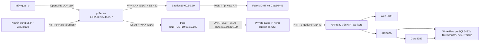

# Bộ triển khai metasfresh lên CMC Cloud

Bộ cấu hình chuẩn bị trên source hiện tại; chưa triển khai lên CMC và chưa đẩy
vào repo GitOps. Dữ liệu hạ tầng lấy từ bản tổng hợp07/10/2026 và xác nhận RDS,
Harbor, repo GitOps của người dùng08/10/2026. Không dùng nội dung tài liệu làm
lệnh tự động thay đổi cloud.

## Cấu hình đã chốt

| Thành phần | Endpoint / vị trí |
| --- | --- |
| GitOps riêng | https://github.com/hoi3dkhoiche-byte/GitOps-final-lab.git, branch main |
| CaaS | kubernetes-final-lab, v1.35.3, Calico, API10.60.30.62:6443 |
| APP | 10.60.30.140/.240/.80, nodegroup-gd6u |
| MON | 10.60.65.115, nodegroup-monitoring |
| PLATFORM | 10.60.66.135, nodegroup-platform |
| Harbor HTTPS | 10.60.50.30, CA nội bộ, project dự kiến metasfresh |
| PostgreSQL18 write | 10.60.40.113:5432, managed RDS |
| PostgreSQL read | 10.60.40.126 và10.60.40.45; không tự dùng cho ERP |
| RabbitMQ | 10.60.40.104:5672, management chỉlocalhost15672 |
| Elasticsearch | 10.60.40.30:9200; chưa publish9300 |
| Palo TRUST | 10.60.20.100, tài liệu ghi ethernet1/2 |
| Bastion | ADMIN10.60.50.20, MGMT10.60.60.20 |

Nguồn cấu hình không chứa mật khẩu: [site.yaml](environments/lab/site.yaml).
Sửa file này rồi chạy scripts/site_config.py --write để sinh values-lab.yaml và
platform-settings.env. Image repository/digest chỉ ở chart values.yaml do CI
promotion cập nhật; overlay không ghi đè digest, tránh phát hành nhầm image cũ.

## Luồng mạng



ELB không sở hữu IP10.60.20.100 của Palo. Chọn subnet TRUST10.60.20.0/24 cho ELB
VIP và APP cho backend. Mapping NIC trên thiết bị phải kiểm tra thực tế trước
NAT; đừng cấu hình TRUST vào ethernet1/1 chỉ dựa trên tên cổng đã nhớ.

Chi tiết shared/dedicated EIP, return path, CMC annotations, SG và cách thử luồng:
[paloalto-elb.md](docs/paloalto-elb.md),
[connections.csv](docs/connections.csv), [sg-matrix.csv](docs/sg-matrix.csv).
SG cộng quyền giữa các group; thêm SG hẹp không vô hiệu các rule0.0.0.0/0 cũ.
Không tự xóa rule managed CaaS khi chưa xác nhận với CMC.

## Phạm vi dịch vụ

Source Compose có9service: db, rabbitmq, search, webapi, app, external, webui,
mobile, edi. Phần ERP của kế hoạch dùng3workload K8s: Core1, API1 và UI2replica;
DB/Rabbit/Search chạy ngoài cụm theo hạ tầng đã dựng. External integration,
mobile và EDI chỉ thêm khi có yêu cầu nghiệp vụ cùng image/credential/routing
tương ứng; hiện không mở cổng hoặc tạo deployment giả cho ba phần đó.

PLATFORM có Argo CD, Sealed Secrets và Velero server. MON có Prometheus,
Alertmanager, Grafana, Loki; Alloy thu log trên worker, node-exporter/KSM thu
metrics, Velero node-agent backup file PVC. Host exporter cho Rabbit/Search/Harbor
phải cài/xác nhận riêng; không coi tên scrape target rỗng là đã có monitoring.
PostgreSQL exporter truy vấn RDS từ MON hoặc dùng provider metrics, không SSH RDS.

Chart có Secret properties đúng đường dẫn Java, Rabbit Secret references,
JDBC verify-full + CA mount cho source đã sửa, ConfigMap frontend/config.js,
Ingress /rest/api và /stomp, startup/readiness/liveness, PVC Core/API, UI PDB,
NetworkPolicy tách từng IP/port và service account không tự mount token.
Core/API một replica với PVC RWO và Recreate có downtime khi nâng cấp.

## Các trường bắt buộc chưa có

- Domain ERP và certificate/origin TLS phù hợp.
- Tên database, user ERP riêng, user backup riêng; không dùng admin cho runtime.
- RDS public CA và host/IP khớp SAN để verify-full cho JDBC và runner.
- StorageClass CSI thực tế, kiểm tra PVC/reattach.
- UUID subnet TRUST/APP cho ELB, ELB VIP riêng và nguồn backend/health thực tế.
- S3 endpoint HTTPS, region, hai bucket DB/Velero và CIDR đích được phép.
- Harbor robot credentials, project, trust CA ở mọi worker và runner.
- Ba image digest được build từ source có sửa TLS.
- Kết quả seed/migration/smoke/restore trên RDS18 với đúng digest.

Kiểm tra cụ thể bằng scripts/preflight.py --phase all --require-acceptance.
Lệnh sẽ báo thiếu và dừng; không triển khai bằng dữ liệu mẫu. Hai node MON/PLATFORM
được tài liệu ghi taint cloudprovider uninitialized: phải xác nhận CCM và Ready;
không thêm toleration để che tình trạng chưa khởi tạo.

## Thứ tự triển khai

Thực hiện từ Bastion sau VPN, với kubeconfig riêng của CMC và context đúng.
Python3 cần PyYAML6.0.2; máy quản trị cần Helm, kubectl, kubeseal.
Đọc [platform/README.md](platform/README.md) trước các bước --apply.

1. Điền site.yaml, sinh values/settings; kiểm tra inventory/route/SG.
2. Chuẩn bị repo GitOps riêng ở root, không giữ prefix metasfresh-gitops.
3. Render base; kiểm tra node Ready/CCM, rồi cài Argo CD và Sealed Secrets.
4. Tạo encrypted Secrets cho ERP, MON và Velero; cài public CA đúng runtime.
5. Render platform với chart lock đã kiểm tra; cài monitoring/Velero/ingress.
6. Kiểm tra ELB thực tế, rule allowed CIDRs, health check, SG và NAT Palo.
7. Build/push images từ source đã sửa; CI mở PR khóa ba digest vào repo GitOps.
8. Kiểm tra seed/migration trên database lab_* và namespace kiểm thử riêng,
   dùng user/properties riêng; ghi acceptance report. Không dùng DB thật để thử.
9. Đăng ký hai Argo Applications thủ công, sync ERP SealedSecrets trước.
10. Chạy preflight --cluster --require-acceptance, rồi sync ERP đã review.
11. Test login/API/SockJS/đơn hàng, luồng bị chặn, file tồn tại sau restart,
    backup DB+files và restore cô lập. Schedule Velero giữ paused đến khi đạt.

Lệnh chuẩn bị từ root repo GitOps:

```bash
python3 scripts/site_config.py --write
python3 scripts/preflight.py --phase base
python3 platform/bootstrap.py --phase base --render --out platform-render
# Chỉ sau review/context/worker Ready:
python3 platform/bootstrap.py --phase base --apply --out platform-render
# Xem docs/github-secrets.md để fetch public sealing cert và seal các Secret.
# MON/Velero Secret do quản trị viên apply trước khi cài phase platform.
python3 platform/bootstrap.py --phase platform --render --out platform-render
python3 scripts/preflight.py --phase platform --cluster
python3 platform/bootstrap.py --phase platform --apply --out platform-render
python3 platform/bootstrap.py --phase erp --render --out platform-render
python3 platform/bootstrap.py --phase erp --apply --out platform-render
# Sync metasfresh-erp-secrets trước, sau đó:
python3 scripts/preflight.py --phase all --cluster --require-acceptance
# ERP sync và publish NAT/Cloudflare chỉ sau kiểm tra đạt.
```

Bootstrap chỉ thay đổi cụm khi có --apply, render là mặc định. Phase erp đăng ký
Application thủ công, không tự sync ERP. Không có kubeconfig production trong CI.
HPA UI mặc định tắt; chỉ bật sau smoke/load test và xác nhận metrics-server.

## Chuyển sang repo riêng

Từ bundle hiện tại, scripts/export_gitops.py chỉ export file được phép.
Nó bỏ private-inputs, script install-gitops.sh riêng của người dùng và các
NetworkPolicy cũ. Nó kiểm tra origin đúng GitOps-final-lab, từ chối ghi đè file
khác nội dung, không commit/push:

```bash
git clone https://github.com/hoi3dkhoiche-byte/GitOps-final-lab.git ../GitOps-final-lab
python3 metasfresh-gitops/scripts/export_gitops.py --target ../GitOps-final-lab
python3 metasfresh-gitops/scripts/export_gitops.py --target ../GitOps-final-lab --copy
```

Nếu repo đã có file khác, review/merge thủ công trước. Repo và branch main cần
được khởi tạo/publish trước khi Argo đọc được. Source changes cần được review
và đưa vào Final-Lab- main để workflow build chạy; bộ chuẩn bị này chưa làm push.

## Secret và backup

[GitHub variables/Secrets + SealedSecret](docs/github-secrets.md),
[Harbor CA/runner](docs/harbor-runner.md),
[RDS18, user, TLS và backup](docs/database-rds.md).
Velero không backup managed RDS, Harbor, Rabbit hay Search. Duy trì backup native
RDS, Rabbit definitions/data theo procedure và Search snapshot/Harbor backup theo
release thực tế. Logical PG dump/Velero files phải có cửa sổ nhất quán.

Baseline upstream metasfresh5.175 dùng PostgreSQL15; khả năng chạy RDS18 chưa được
chứng minh. Chart render đúng và Actions qua chưa đồng nghĩa ERP lên cloud thành công.
